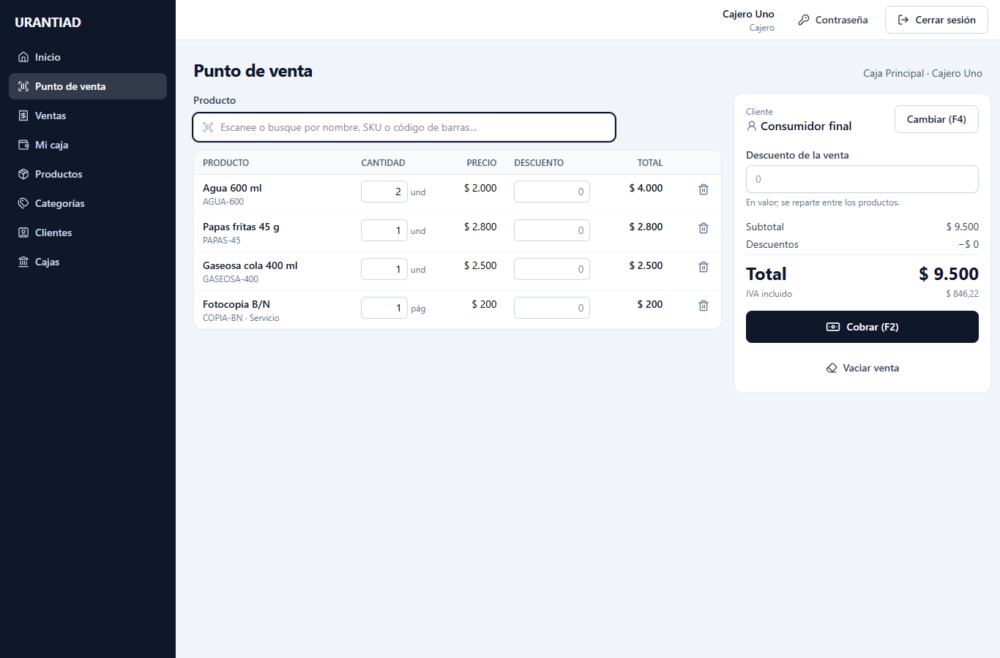
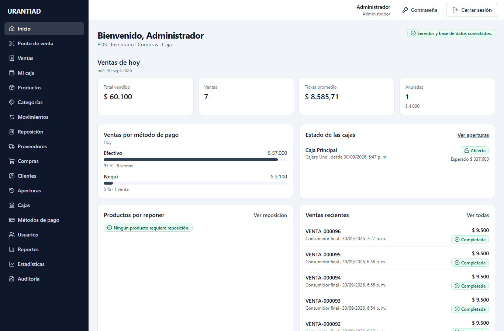
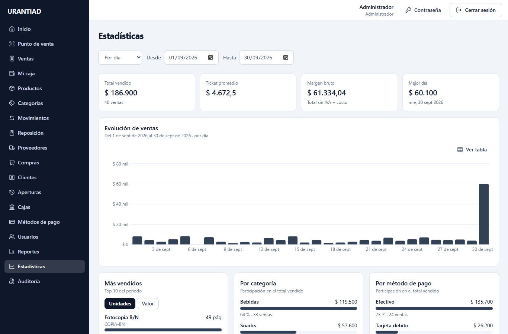
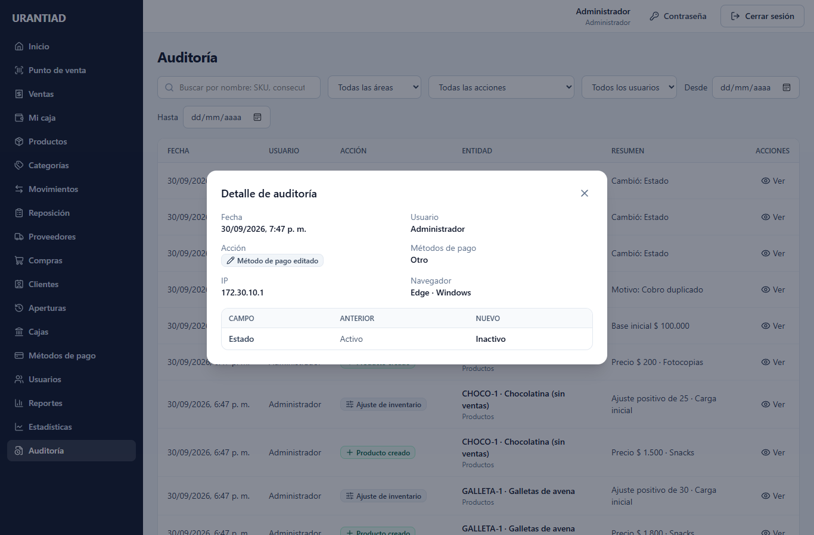
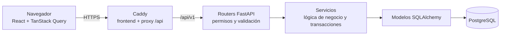

# URANTIAD

Sistema web full stack de **punto de venta, inventario, compras, proveedores, caja, reportes, estadísticas y auditoría** para un negocio de productos comestibles, bebidas, productos de consumo y servicios de fotocopias e impresiones.

Proyecto de portafolio construido por etapas con criterios de producción: cada operación de dinero o inventario es transaccional, los registros operativos nunca se borran, los permisos se validan en el backend y todo el flujo está cubierto por pruebas contra PostgreSQL real. Especificación funcional en [docs/ESPECIFICACION.md](docs/ESPECIFICACION.md) y decisiones por etapa en [docs/PROGRESS.md](docs/PROGRESS.md).

| Punto de venta | Dashboard |
|---|---|
|  |  |
| **Estadísticas** | **Auditoría** |
|  |  |

## Funcionalidades

- **POS** pensado para lector de código de barras y teclado (F2 cobrar, F4 cliente), pagos mixtos, descuentos por línea y por venta, cambio en efectivo y anulación con reversión de inventario y caja.
- **Inventario** con costo promedio ponderado, ajustes con motivo, historial de movimientos, alertas por nivel de stock y sugerencia de reposición.
- **Compras** en borrador y confirmación con consecutivo, entrada de inventario, historial de costos y anulación que restaura el costo exacto.
- **Caja**: apertura, ingresos, retiros, arqueo y cierre con diferencia (sobrante o faltante) y supervisión de todas las aperturas.
- **Reportes** de ventas, compras, inventario y caja con exportación a CSV para Excel; **dashboard** del día y **estadísticas** (tendencia, más vendidos, participación por categoría y método de pago, rotación de inventario).
- **Auditoría** inmutable (trigger de PostgreSQL) con valores anteriores y nuevos, IP y navegador.
- **Usuarios, roles y permisos** (Administrador, Cajero, Inventario) con JWT, refresh token rotativo en cookie `httpOnly` y bloqueo por intentos fallidos.

## Decisiones técnicas destacadas

- **Integridad**: una venta (consecutivo, líneas, pagos, salidas de inventario y movimiento de caja) es una sola transacción. El stock se modifica con `SELECT … FOR UPDATE` bloqueando productos en orden de id, y los consecutivos salen de una tabla de secuencias bloqueada: sin sobreventa, sin huecos ni duplicados. Pruebas de concurrencia con hilos y sesiones reales verifican cada bloqueo.
- **Dinero exacto**: `NUMERIC(14,2)` y `Decimal` en el backend; en el frontend los importes viajan como texto y se calculan en centavos (`bigint`) con el mismo redondeo del backend.
- **Nada se borra**: ventas y compras se anulan con movimientos inversos; productos, proveedores y usuarios se desactivan.
- **Permisos explícitos** por endpoint (sin bypass para el administrador); los costos y márgenes solo se muestran con `products.view_costs`, también en reportes y estadísticas.
- **Rendimiento**: reportes y estadísticas son consultas agrupadas únicas (sin N+1), índices trigram para búsquedas y carga del frontend dividida por rutas (el POS no descarga la librería de gráficos).
- **Producción**: Caddy con HTTPS automático sirve el frontend y hace de proxy de la API en el mismo origen; backend sin puerto público, base de datos en red interna, respaldos con `pg_dump`.

## Stack

| Capa | Tecnologías |
|---|---|
| Frontend | React 19, TypeScript, Vite, Tailwind CSS v4, React Router, TanStack Query, React Hook Form + Zod, Recharts |
| Backend | Python 3.12, FastAPI, Pydantic v2, SQLAlchemy 2 (síncrono), Alembic, psycopg 3, Argon2, JWT |
| Base de datos | PostgreSQL 17 |
| Calidad | Ruff, pytest (469 pruebas), ESLint, Prettier, Vitest + React Testing Library (164 pruebas) |
| Infraestructura | Docker Compose, Caddy, GitHub Actions, uv, Postman |

## Arquitectura



En desarrollo el frontend corre en el servidor de Vite y llama a la API directamente (CORS); en producción ambos quedan detrás de Caddy en el mismo origen.

```
backend/
  app/
    api/v1/        # routers y endpoints (sin lógica de negocio)
    core/          # configuración, base de datos, errores, permisos, seguridad, origen de la petición
    models/        # modelos SQLAlchemy (Base con convención de nombres)
    schemas/       # schemas Pydantic de entrada/salida
    services/      # lógica de negocio
    cli.py         # comandos administrativos (create-admin)
    main.py        # creación de la app FastAPI
  alembic/         # migraciones
  tests/           # pytest contra PostgreSQL real
frontend/
  src/
    pages/ components/ hooks/ services/ types/ utils/
docker/postgres/   # script de inicio de desarrollo (crea la base de datos de pruebas)
docker/caddy/      # Caddyfile de producción
scripts/           # respaldo y restauración de la base de producción
docs/postman/      # colección "URANTIAD API"
```

## Módulos

### Autenticación y permisos

- `POST /api/v1/auth/login` devuelve un **access token JWT** (15 min) que se envía como `Authorization: Bearer <token>`, y deja un **refresh token** en una cookie `httpOnly` (`SameSite=Lax`, ruta `/api/v1/auth`).
- `POST /api/v1/auth/refresh` rota el refresh token (se guarda solo su hash). Reutilizar un token ya rotado revoca todas las sesiones del usuario.
- Contraseñas con hash **Argon2**. Bloqueo temporal tras varios intentos fallidos.
- Autorización por **permisos** (`users.read`, `users.manage`, …) asignados a roles (Administrador, Cajero, Inventario). Cada endpoint declara el permiso que exige con `require_permission(...)`. Roles y permisos se crean por migración.
- Los usuarios no se borran: se desactivan (pierden el acceso de inmediato).
- En el frontend el access token vive **solo en memoria** (nunca en `localStorage`). Al recargar la página la sesión se recupera con `POST /auth/refresh`; ante un 401 el cliente HTTP renueva la sesión una vez y repite la petición. Las rutas se protegen con `ProtectedRoute` y `RequirePermission`, y el menú muestra solo las secciones permitidas (el backend valida siempre).

### Catálogo (categorías y productos)

- Un producto es `type = product` (maneja inventario) o `type = service` (fotocopias, impresiones: sin stock).
- El **precio de venta incluye IVA** (`tax_rate` es el porcentaje incluido). Cada cambio de precio queda en `product_price_history`.
- El stock y el costo de los productos **no se editan**: cambian solo con movimientos de inventario (ajustes y compras). Los servicios tienen un costo de referencia manual.
- Los costos solo se muestran con el permiso `products.view_costs` (administrador e inventario); para el cajero la API los devuelve en `null`.
- `stock_status` se calcula (no se guarda): `out_of_stock` (stock ≤ 0), `critical` (≤ mínimo), `low` (≤ punto de reorden) u `ok`.
- La búsqueda por nombre, SKU o código de barras usa índices trigram (`pg_trgm`, creada por la migración).
- Una categoría con productos no se elimina: se desactiva.
- En el frontend los importes viajan como texto decimal (`"2500.00"`) y nunca se convierten a `number`: se formatean con `Intl` y se comparan en centavos (`utils/decimal.ts`). Los campos numéricos rechazan puntos de miles ("2.500") para no confundirlos con decimales.

### Inventario

- El stock cambia **solo** mediante movimientos (`inventory_movements`), que son inmutables: guardan tipo, cantidad, stock anterior y nuevo, costo unitario, costo promedio resultante, motivo, usuario y fecha. Un `CHECK` garantiza que `stock_after = stock_before ± cantidad`.
- Tipos: entrada por compra, anulación de compra, venta, ajuste positivo y negativo, devolución de compra, devolución de venta y anulación de venta (las devoluciones llegarán en una etapa futura). Los movimientos enlazan su documento de origen (`purchase_id`, `sale_id`).
- **Ajustes manuales** (`inventory.adjust`) con motivo obligatorio. Una entrada con costo recalcula el **costo promedio ponderado** y el último costo (así se hace la carga inicial); sin costo, se valora al promedio actual. Las salidas usan el costo promedio.
- **Stock negativo** no permitido por defecto (`ALLOW_NEGATIVE_STOCK`). Las unidades contables (unidad, paquete, caja, página) solo aceptan cantidades enteras.
- Cada movimiento bloquea la fila del producto (`SELECT … FOR UPDATE`): dos operaciones simultáneas sobre el mismo producto se aplican en serie y nunca venden stock inexistente.
- **Reposición:** productos activos con stock ≤ punto de reorden, los más urgentes primero, con cantidad sugerida = stock objetivo − stock actual.
- En el frontend: páginas de movimientos y de reposición, y un modal de ajuste con selector de producto compatible con lector de código de barras (Enter selecciona la coincidencia exacta) y vista previa del stock resultante.

### Proveedores

- Proveedores con tipo y número de documento únicos en conjunto (`nit`, `cc`, `ce`, `passport`, `other`); el número se guarda sin puntos ni espacios. No se eliminan: se desactivan.
- **Productos por proveedor** (`supplier_products`): código del producto en el proveedor, precio de compra **sin IVA** (la misma base que el costo promedio), fecha del último precio (cambia solo cuando cambia el precio) y observaciones. Solo productos físicos activos y proveedores activos; la asociación sí se puede eliminar.
- Consultas en ambos sentidos: `GET /suppliers/{id}/products` y `GET /products/{id}/suppliers` (el precio más reciente primero).
- Permisos `suppliers.read` y `suppliers.manage` (administrador e inventario).
- En el frontend: página `/proveedores` (búsqueda, estado, crear/editar/desactivar) con un modal de productos del proveedor (asociar con el selector compatible con lector de código de barras, editar código y precio, quitar), y la acción "Proveedores" en la tabla de productos.

### Compras

- Estados **borrador → confirmada → anulada**. El borrador se edita libremente (`PUT` reemplaza cabecera y líneas) o se descarta; no mueve inventario ni consume consecutivo.
- Costos **sin IVA**, descuento por línea en valor e IVA por línea (por defecto el del producto). Los totales los calcula el backend y `CHECK`s en la base garantizan su coherencia (`total = subtotal − descuentos + IVA`, `saldo = total − pagado`).
- **Confirmar** (una transacción): consecutivo `COMPRA-000001` desde `document_sequences` (fila bloqueada, sin huecos), entradas de inventario al costo neto de cada línea (recalcula costo promedio y último costo) y alta o actualización del precio en productos por proveedor.
- **Anular** (solo administrador, `purchases.cancel`): movimientos inversos al costo de la compra. Si la compra es el último movimiento del producto, el costo promedio y el último costo vuelven exactamente a sus valores previos (cada movimiento guarda esa instantánea); si hubo movimientos después, la compra se retira del promedio con la fórmula inversa y el último costo vuelve al de la compra confirmada más reciente. Si las unidades ya no están en stock, falla sin cambios.
- Una factura de proveedor no se registra dos veces (índice único parcial que ignora compras anuladas).
- **Historial de costos** (`GET /products/{id}/cost-history`, `products.view_costs`): costo neto por compra, variación frente a la anterior y margen bruto sobre el precio sin IVA. Se consulta sobre las líneas de compras confirmadas, sin tabla duplicada.
- Permisos `purchases.read` y `purchases.manage` (administrador e inventario) y `purchases.cancel` (administrador).
- En el frontend: `/compras` (búsqueda, estado, proveedor y fechas) y el editor `/compras/nueva` · `/compras/:id`. El lector de código de barras agrega la línea con el precio del proveedor (o el último costo) y enfoca su cantidad; Enter vuelve al lector. Totales en vivo con el mismo redondeo del backend; "Guardar y confirmar" muestra un resumen de lo que entra al inventario. Las compras confirmadas se ven en solo lectura, con la acción de anular para el administrador. Acción "Costos" en productos y número de compra enlazado en el historial de movimientos.

### Clientes

- Clientes con tipo y número de documento únicos en conjunto (mismas reglas que proveedores), nombre, teléfono, correo y dirección. No se eliminan: se desactivan.
- La migración crea el cliente del sistema **"Consumidor final"** (`CC 222222222222`, `is_default`), que se usará en las ventas sin cliente registrado. No se puede editar ni desactivar, y un índice único parcial garantiza que solo exista uno.
- Permisos `customers.read` y `customers.manage` (administrador y cajero).
- En el frontend: página `/clientes` (búsqueda por nombre, documento o teléfono; estado; crear/editar/desactivar).

### Caja

- **Cajas** (`cash_registers`): nombre único sin distinguir mayúsculas, descripción y estado. No se eliminan; una caja abierta no se puede desactivar. La migración crea **"Caja Principal"**.
- **Aperturas** (`cash_sessions`): caja, usuario, dinero inicial, observaciones y fecha. Una caja y un usuario tienen como máximo una apertura activa, garantizado por índices únicos parciales (`WHERE status = 'open'`) además de la validación del servicio.
- **Movimientos** (`cash_movements`): ingresos y retiros inmutables con concepto obligatorio, solo en la propia apertura activa. Las ventas registran sus propios movimientos (`sale`, `sale_cancellation`, enlazados con `sale_id`). **Efectivo esperado** = dinero inicial + ingresos + ventas en efectivo − retiros − anulaciones en efectivo. Un retiro no puede superar el efectivo esperado: la apertura se bloquea (`SELECT ... FOR UPDATE`) al registrarlo, así dos retiros simultáneos no dejan la caja en negativo.
- **Arqueo y cierre**: se digita el efectivo contado y se guardan el esperado (fijado al cerrar, con la apertura bloqueada), el contado y la **diferencia = contado − esperado** (positiva = sobrante, negativa = faltante). Con diferencia, las observaciones son obligatorias. Si el esperado cambió mientras se contaba (por ejemplo, por una anulación), el cierre se rechaza para revisar de nuevo. El cierre es definitivo: la apertura ya no admite ventas ni movimientos y la caja queda libre. El resumen del cierre incluye las ventas por método de pago (solo el efectivo entra al conteo).
- Permisos `cash_registers.read` y `cash.operate` (administrador y cajero), `cash_registers.manage` y `cash.supervise` (administrador; ver las aperturas de todos y cerrar las que alguien dejó abiertas).
- En el frontend:
  - `/caja` "Mi caja": abrir una caja (las ocupadas aparecen deshabilitadas con quién las tiene), resumen con el efectivo esperado, registrar ingresos y retiros, lista de movimientos y **cerrar caja**: desglose del esperado, ventas por método de pago, efectivo contado con la diferencia en vivo ("Cuadrada", "Sobrante" o "Faltante") y resultado del cierre.
  - `/cajas`: listado con quién tiene abierta cada caja; crear, editar y desactivar (administrador).
  - `/caja/aperturas`: historial de aperturas de todos los usuarios, con contado y arqueo, filtros por caja, estado, arqueo (con sobrante o faltante) y fechas, y detalle con el cierre, las ventas por método y los movimientos; desde el detalle se cierra una apertura que alguien dejó abierta (administrador).

### Ventas

- Una venta nace confirmada, en **una sola transacción**: consecutivo `VENTA-000001`, líneas, pagos, salidas de inventario al costo promedio y entrada de caja por la parte en efectivo. Si algo falla (stock insuficiente, pagos que no cuadran…), no se guarda nada y el número no se consume.
- Requiere una **apertura de caja activa** del usuario; la venta queda asociada a ella. Sin cliente, se usa "Consumidor final".
- El **precio y el costo** de cada línea los toma el servidor del catálogo (nunca del cliente) y quedan guardados para calcular márgenes históricos. Los servicios no mueven inventario.
- **Descuentos** por línea y por venta, en valor. El de la venta se reparte entre las líneas en proporción a su valor (en centavos exactos), así el IVA incluido de cada línea es correcto.
- **Pagos** (`sale_payments`): uno o varios métodos (pago mixto) que deben sumar el total. Los métodos viven en la tabla `payment_methods` (efectivo, Nequi, Daviplata, transferencia, tarjetas, otro); solo el efectivo entra a la caja y admite dinero recibido y cambio.
- **Anular** (`sales.cancel`, administrador) exige motivo: las unidades vuelven al costo con que salieron (el último costo no cambia) y el efectivo sale de la caja de la venta si sigue abierta, o de la caja abierta de quien anula. La venta nunca se borra.
- Se bloquean la apertura, los productos (en orden de id) y la secuencia: dos ventas simultáneas de la última unidad no la venden dos veces.
- **Métodos de pago** (`/api/v1/payment-methods`): el POS lista los activos (`sales.read`); el administrador (`payment_methods.manage`) los ve todos (`include_inactive`), crea (el código se genera del nombre y no cambia), renombra, ordena y desactiva. El efectivo no se puede desactivar (409 `CASH_METHOD_REQUIRED`) y los nombres son únicos sin distinguir mayúsculas. Desactivar un método no cambia las ventas ya pagadas con él. En el frontend, `/metodos-pago` "Métodos de pago".
- Permisos `sales.create` y `sales.read` (administrador y cajero; el cajero solo ve sus ventas), `sales.read_all` y `sales.cancel` (administrador). El costo de las líneas solo se muestra con `products.view_costs`.
- En el frontend:
  - `/pos` "Punto de venta", pensado para teclado y lector de código de barras: el escáner queda siempre enfocado (escanear de nuevo suma una unidad), cantidades y descuentos editables en la tabla, aviso de stock, cliente con **F4** y cobro con **F2**. El cobro abre con efectivo por el total y el foco en "Recibido"; muestra el cambio y admite pagos mixtos. Enter confirma, y en el resumen de la venta Enter inicia la siguiente. Los totales se previsualizan con el mismo redondeo del backend; si un precio cambió, el POS recarga los productos del carrito.
  - `/ventas` (búsqueda, estado y fechas) y `/ventas/:id` (líneas, pagos, cambio y anulación para el administrador).
  - "Mi caja" suma las ventas y anulaciones en efectivo; los movimientos de caja e inventario enlazan la venta de origen.

### Auditoría

- Tabla `audit_logs`: quién, qué acción, cuándo, sobre qué entidad (con su nombre en ese momento) y los **valores anteriores y nuevos** (en ediciones, solo los campos que cambiaron).
- Se registra en **la misma transacción** que la operación: si la operación falla, no queda registro.
- Se auditan: creación y edición de productos (incluidos precios), ajustes de inventario, anulación de ventas, aperturas, ingresos, retiros y cierres de caja, compras (creación, descarte, confirmación y anulación), proveedores y sus productos, usuarios (creación, cambios de rol o estado y restablecimiento de contraseña, sin guardarla) y métodos de pago.
- La creación de ventas no se audita: la venta misma es un registro inmutable con su cajero y hora.
- Cada registro guarda la **IP y el navegador** (`User-Agent`) de la petición, tomados por un middleware sin cambiar las firmas de los servicios (nulos para `create-admin`). La IP es la de la conexión: detrás de un proxy, uvicorn debe correr con `--proxy-headers` y `--forwarded-allow-ips` limitado al proxy; la aplicación nunca lee `X-Forwarded-For` por su cuenta.
- Es **inmutable**: un trigger de PostgreSQL rechaza `UPDATE`, `DELETE` y `TRUNCATE`, salvo en una transacción que active `SET LOCAL app.audit_maintenance = 'on'` (solo lo usan las pruebas para purgar sus datos). Protege frente a la aplicación, no frente al dueño de la base de datos.
- `GET /api/v1/audit-logs` con filtros por entidad, acción, usuario, búsqueda y fechas. Permiso `audit.read` (administrador).
- En el frontend, `/auditoria` "Auditoría" (administrador): tabla con fecha, usuario, acción (color + icono + texto), entidad (enlazada a la venta o compra) y un resumen; filtros por área, acción, usuario, búsqueda y fechas; y el detalle con los valores anteriores y nuevos de cada campo, la IP y el navegador (resumido, p. ej. "Edge · Windows").

### Reportes

- Solo lectura y sin tablas propias: cada reporte es una consulta agrupada (una página de grupos) más el resumen del periodo, con los mismos filtros. Los días se agrupan en la hora del negocio (`BUSINESS_TIMEZONE`).
- `GET /api/v1/reports/sales` (`sales.read_all`): ventas completadas por día, cajero, caja, producto, categoría o método de pago; total, descuentos, IVA incluido, total sin IVA, costo, margen bruto y margen % (costos solo con `products.view_costs`). Las ventas anuladas no suman y se muestran aparte.
- `GET /api/v1/reports/purchases` (`purchases.read`): compras confirmadas por proveedor, producto, categoría o día de confirmación.
- `GET /api/v1/reports/inventory` (`inventory.read`): productos físicos activos por nivel de stock y valor del inventario al costo promedio, por categoría.
- `GET /api/v1/reports/cash` (`cash.supervise`): aperturas por día, caja o cajero: movimientos, esperado y contado, sobrantes y faltantes por separado.
- Los permisos son los del listado de cada área: un reporte no muestra nada que ese usuario no pueda consultar ya.
- **Exportación a CSV** (`GET /api/v1/reports/{sales|purchases|inventory|cash}/export`, mismos permisos y filtros, sin paginación): archivo para Excel en español (UTF-8 con BOM, separador `;`, coma decimal) con las mismas columnas de la pantalla, todas las filas y una fila final "Total". Máximo 10.000 filas (422 `REPORT_TOO_LARGE`). CORS expone `Content-Disposition` para que el frontend lea el nombre del archivo.
- En el frontend, `/reportes` "Reportes" con una pestaña por área (solo las permitidas): agrupación, periodo (por defecto el mes en curso), filtros de cajero, caja, categoría, proveedor y producto, tarjetas de resumen y la tabla agrupada y paginada. La pestaña de inventario enlaza a productos, reposición y movimientos. Cada pestaña tiene el botón "Exportar CSV" con los filtros en pantalla.

### Dashboard

- `GET /api/v1/dashboard` (requiere sesión, sin permiso propio): resumen del día en la hora del negocio (`BUSINESS_TIMEZONE`). Cada sección llega en `null` sin el permiso de su área: ventas del día y por método de pago, y ventas recientes (`sales.read`; el cajero solo ve las suyas), estado de las cajas activas (`cash_registers.read`; efectivo esperado solo con `cash.supervise`), productos agotados y por reponer (`inventory.read`) y compras recientes (`purchases.read`, sin borradores).
- En el frontend, la página de inicio (`/`) muestra las secciones permitidas y se recarga cada minuto mientras la pestaña está visible.

### Estadísticas

- Periodos en días locales (`date_from` y `date_to` incluidos, hora de `BUSINESS_TIMEZONE`); solo ventas completadas; margen solo con `products.view_costs`. Las ventas por categoría y por método de pago se obtienen del reporte de ventas.
- `GET /api/v1/statistics/sales-trend` (`sales.read_all`): ventas por día, semana (desde el lunes) o mes; el rango se amplía a periodos completos y los periodos sin ventas llegan en cero (máximo 400 puntos, 422 `STATISTICS_RANGE_TOO_LARGE`).
- `GET /api/v1/statistics/top-products` (`sales.read_all`): productos y servicios más vendidos por unidades o por valor.
- `GET /api/v1/statistics/inventory-rotation` (`inventory.read`, paginado): por producto físico activo, rotación = unidades vendidas / stock promedio ponderado por tiempo (cada nivel de stock cuenta el tiempo que duró) y días de inventario = stock final / venta diaria. Se mide desde el inicio del periodo, o desde la llegada del producto si empezó sin stock, hasta el fin del periodo u hoy. El stock de una fecha se reconstruye con el stock actual menos lo que sumaron los movimientos posteriores.
- En el frontend, `/estadisticas` "Estadísticas" (con `sales.read_all` o `inventory.read`; cada sección según el permiso de su área): agrupación por día, semana o mes con periodo por defecto (30 días, 12 semanas o 12 meses), tarjetas de resumen, gráfico de columnas de la evolución de ventas con tooltip y vista en tabla, más vendidos por unidades o valor, participación por categoría y por método de pago, y la tabla de rotación. La página se carga bajo demanda: la librería de gráficos (Recharts) no se descarga en el POS ni en las demás páginas.

Todas las respuestas de error de la API tienen el formato `{ "detail": "mensaje claro", "code": "CODIGO_ERROR" }`.

## Requisitos

- Docker y Docker Compose (desarrollo y producción).
- Para desarrollo local fuera de Docker: Python 3.12+ con [uv](https://docs.astral.sh/uv/) y Node.js 24+.

## Desarrollo con Docker

```bash
cp .env.example .env
docker compose up --build
```

| Servicio | URL |
|---|---|
| Frontend | http://localhost:5173 |
| API | http://localhost:8000/api/v1 |
| Swagger | http://localhost:8000/docs |
| PostgreSQL | localhost:5432 (bases `urantiad` y `urantiad_test`) |

El backend aplica las migraciones (`alembic upgrade head`) al arrancar. Backend y frontend se recargan automáticamente al editar el código. Si cambian las dependencias (`pyproject.toml` o `package.json`), reconstruya con `docker compose up -d --build`.

Crear el primer administrador (pide la contraseña de forma interactiva):

```bash
docker compose exec backend python -m app.cli create-admin
```

## Desarrollo local (sin Docker para backend/frontend)

Levantar solo la base de datos:

```bash
docker compose up -d db
```

Backend:

```bash
cd backend
cp .env.example .env
uv sync
uv run alembic upgrade head
uv run python -m app.cli create-admin   # solo la primera vez
uv run uvicorn app.main:app --reload
```

Frontend:

```bash
cd frontend
cp .env.example .env
npm install
npm run dev
```

## Variables de entorno

| Archivo | Variable | Descripción |
|---|---|---|
| `.env` | `POSTGRES_USER`, `POSTGRES_PASSWORD`, `POSTGRES_DB` | Credenciales del contenedor de PostgreSQL |
| `.env` | `POSTGRES_PORT`, `BACKEND_PORT`, `FRONTEND_PORT` | Puertos publicados en el host |
| `.env` / `backend/.env` | `CORS_ORIGINS` | Orígenes permitidos, separados por comas |
| `.env` / `backend/.env` | `LOG_LEVEL` | Nivel de log (`INFO`, `DEBUG`, …) |
| `backend/.env` | `ENVIRONMENT` | `development`, `test` o `production` (en producción se desactiva Swagger) |
| `backend/.env` | `DATABASE_URL` | Conexión SQLAlchemy (`postgresql+psycopg://…`) |
| `backend/.env` | `TEST_DATABASE_URL` | Base de datos usada por pytest |
| `.env` / `backend/.env` | `JWT_SECRET_KEY` | Clave para firmar los JWT (obligatoria, mínimo 32 caracteres) |
| `backend/.env` | `ACCESS_TOKEN_EXPIRE_MINUTES` | Vida del access token (por defecto 15) |
| `backend/.env` | `REFRESH_TOKEN_EXPIRE_HOURS` | Vida de la sesión / refresh token (por defecto 12) |
| `backend/.env` | `COOKIE_SECURE` | `true` en producción (cookie solo por HTTPS) |
| `backend/.env` | `LOGIN_MAX_ATTEMPTS`, `LOGIN_LOCKOUT_MINUTES` | Bloqueo por intentos fallidos (por defecto 5 intentos, 15 min) |
| `.env` / `backend/.env` | `ALLOW_NEGATIVE_STOCK` | Permite que las salidas dejen stock negativo (por defecto `false`) |
| `backend/.env` | `BUSINESS_TIMEZONE` | Zona horaria con la que los reportes agrupan por día y el dashboard define "hoy" (por defecto `America/Bogota`) |
| `frontend/.env` | `VITE_API_URL` | URL base de la API |
| `.env.production` | `DOMAIN` | Dominio público; Caddy obtiene su certificado HTTPS (`localhost` usa uno local, para pruebas) |
| `.env.production` | `POSTGRES_*`, `JWT_SECRET_KEY`, `ALLOW_NEGATIVE_STOCK`, `BUSINESS_TIMEZONE`, `LOG_LEVEL` | Como en desarrollo; contraseña y secreto obligatorios |
| `.env.production` | `WEB_CONCURRENCY` | Procesos del backend (por defecto 2) |
| `.env.production` | `WEB_SUBNET` | Subred de Caddy y el backend; el backend solo acepta `X-Forwarded-For` desde ella |
| `.env.production` | `BACKUP_KEEP_DAYS` | Días que `scripts/backup.sh` conserva cada respaldo (por defecto 14) |
| `.env.production` | `HTTP_PORT`, `HTTPS_PORT` | Puertos publicados por Caddy (por defecto 80 y 443; cambiarlos solo para pruebas locales) |

Los archivos `.env` y `.env.production` nunca se versionan; mantener actualizados los `.env.example` y `.env.production.example`.

## Migraciones

```bash
cd backend
uv run alembic revision --autogenerate -m "describe change"   # revisar el archivo generado antes de aplicar
uv run alembic upgrade head
uv run alembic downgrade -1
```

## Pruebas y calidad

Backend (requiere el contenedor `db` en marcha; usa la base `urantiad_test` y revierte cada test en una transacción). Las pruebas de concurrencia (`test_inventory_concurrency.py`) usan dos sesiones reales: confirman sus propios datos y los eliminan al terminar.

```bash
cd backend
uv run pytest
uv run ruff check .
uv run ruff format .
```

Frontend:

```bash
cd frontend
npm test
npm run lint
npm run format:check
npm run typecheck
```

## Integración continua

GitHub Actions ([.github/workflows/ci.yml](.github/workflows/ci.yml)) ejecuta en cada push y pull request a `main`:

- **Backend:** Ruff (lint y formato), migraciones contra PostgreSQL y pytest.
- **Frontend:** ESLint, Prettier, TypeScript, Vitest y build.
- **Imágenes de producción:** construye y levanta `docker-compose.prod.yml` con `DOMAIN=localhost` y comprueba a través de Caddy (HTTPS) la salud de la API, una ruta del frontend, la política de seguridad de contenido y que el backend no esté publicado.

## Despliegue en producción

Un servidor (VPS) con Docker ejecuta tres contenedores definidos en [docker-compose.prod.yml](docker-compose.prod.yml):

| Servicio | Función | Expuesto |
|---|---|---|
| `caddy` | HTTPS automático (Let's Encrypt), sirve el frontend compilado y hace de proxy de `/api` ([docker/caddy/Caddyfile](docker/caddy/Caddyfile)) | Puertos 80 y 443 |
| `backend` | FastAPI con uvicorn (2 procesos, usuario sin privilegios); aplica las migraciones al arrancar | Solo a Caddy |
| `db` | PostgreSQL 17 con volumen persistente | Solo al backend (red interna) |

Frontend y API comparten origen: no hay CORS y la cookie de sesión viaja solo por HTTPS (`COOKIE_SECURE=true`). Swagger está desactivado en producción. Caddy añade HSTS, `Content-Security-Policy` y otras cabeceras de seguridad, y cachea para siempre los archivos con hash (`/assets`) mientras `index.html` se revalida en cada visita.

### Primera instalación

1. Servidor Linux con Docker Engine y el plugin Compose, con los puertos 80 y 443 abiertos (y el 22 para SSH; nada más).
2. Registro DNS `A` (y `AAAA` si hay IPv6) del dominio apuntando al servidor. Caddy obtiene el certificado al arrancar, así que el DNS debe estar propagado.
3. Código y configuración:

   ```bash
   git clone <repositorio> /opt/urantiad && cd /opt/urantiad
   cp .env.production.example .env.production
   chmod 600 .env.production
   # Editar DOMAIN y generar POSTGRES_PASSWORD y JWT_SECRET_KEY (los comandos están en el archivo)
   ```

4. Construir y arrancar:

   ```bash
   docker compose -f docker-compose.prod.yml --env-file .env.production up -d --build
   docker compose -f docker-compose.prod.yml --env-file .env.production ps   # todo "healthy"/"running"
   ```

5. Crear el primer administrador (pide la contraseña):

   ```bash
   docker compose -f docker-compose.prod.yml --env-file .env.production exec backend python -m app.cli create-admin
   ```

6. Abrir `https://<dominio>`, iniciar sesión y crear los usuarios, cajas y catálogo.

### Actualizar

```bash
cd /opt/urantiad
scripts/backup.sh                 # respaldo antes de cambiar de versión
git pull
docker compose -f docker-compose.prod.yml --env-file .env.production up -d --build
```

El backend aplica las migraciones pendientes al arrancar (PostgreSQL revierte completa una migración que falle). Los datos viven en volúmenes de Docker y no se tocan al reconstruir.

### Respaldos

- [scripts/backup.sh](scripts/backup.sh) guarda un `pg_dump` comprimido en `backups/urantiad-AAAAMMDD-HHMMSS.dump` y borra los de más de `BACKUP_KEEP_DAYS` días (14 por defecto). Programarlo a diario con cron:

  ```cron
  30 2 * * * /opt/urantiad/scripts/backup.sh >> /opt/urantiad/backups/backup.log 2>&1
  ```

- **Copiar los respaldos fuera del servidor** (otro equipo, almacenamiento en la nube): un respaldo en el mismo disco no sirve si se pierde el servidor.
- [scripts/restore.sh](scripts/restore.sh) `backups/<archivo>.dump` reemplaza todos los datos por los del respaldo: pide escribir el nombre de la base para confirmar, detiene el backend mientras restaura y lo hace en una sola transacción (si falla, quedan los datos anteriores). Conviene probar la restauración de vez en cuando.

### IP en la auditoría

La auditoría guarda la IP del cliente. Caddy envía la IP real en `X-Forwarded-For` (ignora la que envíe el cliente) y el backend solo acepta esa cabecera desde la red de Caddy (`--forwarded-allow-ips` = `WEB_SUBNET`). Desde cualquier otro origen se usa la dirección de la conexión, así que la IP no se puede falsificar.

### Lista de verificación de seguridad

- `.env.production` con permisos `600`, secretos generados al azar y nunca versionado.
- Solo los puertos 22, 80 y 443 abiertos en el firewall; acceso SSH con llave.
- Actualizaciones del sistema operativo y de Docker aplicadas; reconstruir las imágenes periódicamente para recibir parches de las imágenes base.
- Respaldos diarios copiados fuera del servidor y restauración probada.
- Contraseña fuerte para el administrador; cada persona con su propio usuario (la auditoría identifica quién hizo cada cambio).

### Despliegue automático (mejora futura)

Para un solo servidor basta la actualización manual de arriba. Un despliegue automático desde GitHub Actions (SSH al servidor con una llave en los secretos del repositorio, tras pasar la CI) queda como mejora futura.

## API

- Documentación interactiva: Swagger en `/docs`.
- Colección de Postman: [docs/postman/urantiad.postman_collection.json](docs/postman/urantiad.postman_collection.json).
